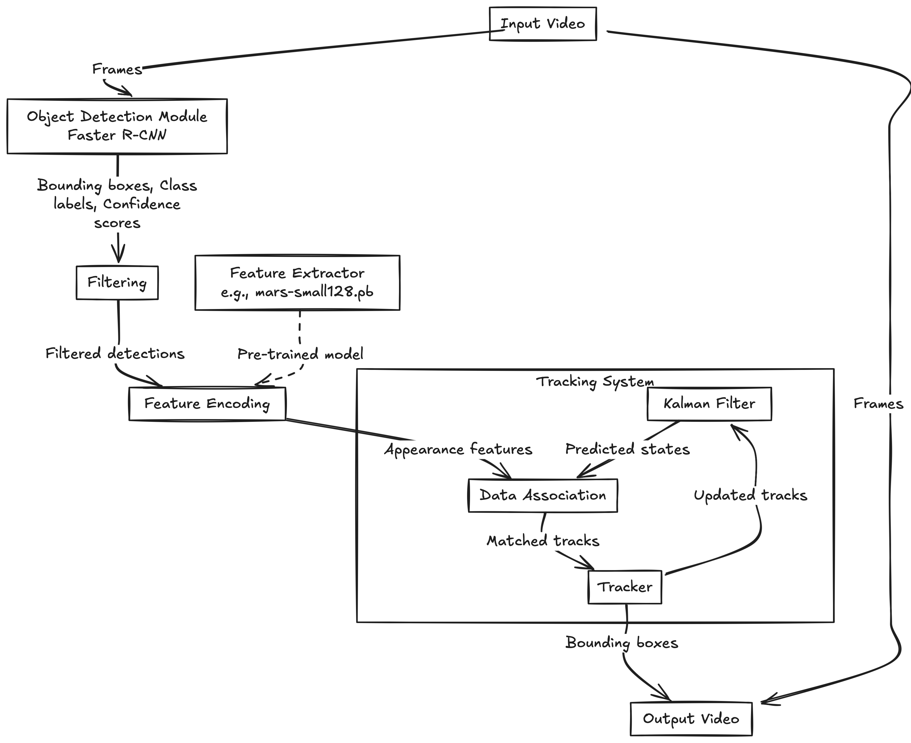

# Sports Analytics Project - AI CS-GY-6613 Assignment 3

This project implements object detection and multi-object tracking for sports analytics using advanced deep learning models. The two main tasks are:

- **Task 1**: Faster R-CNN for object detection
- **Task 2**: Deep SORT for multi-object tracking

Due to the large size of the output videos, they have been uploaded to Google Drive. Here are the links to view the processed videos:

- [Task 1 Output Video](https://drive.google.com/file/d/14UhNF3MDlOqWSr2Qt-C8TGVCBf-oHnfg/view?usp=share_link)
- [Task 2 Output Video](https://drive.google.com/file/d/1GJE41NVVTeRuaL-ZUqg7noX1KgdkvudC/view?usp=share_link)

The videos showcase object detection and tracking of players and the ball in a sports setting, demonstrating the effectiveness of the implemented methods.

Additionally, the overall architecture of the implemented system is rendered in the image below, providing a visual summary of the model flow and data processing pipeline:
---

